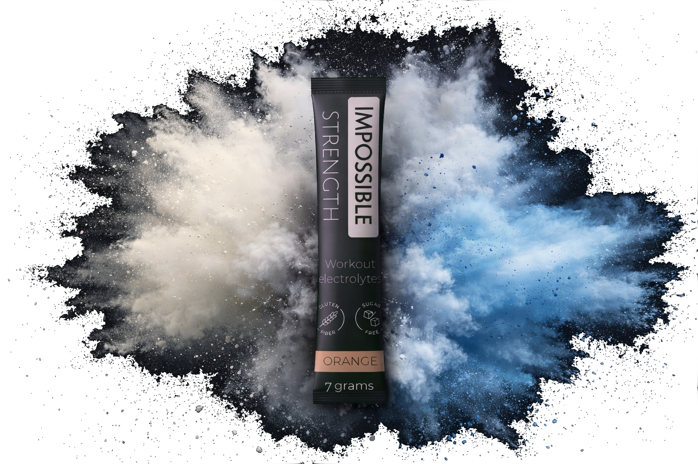
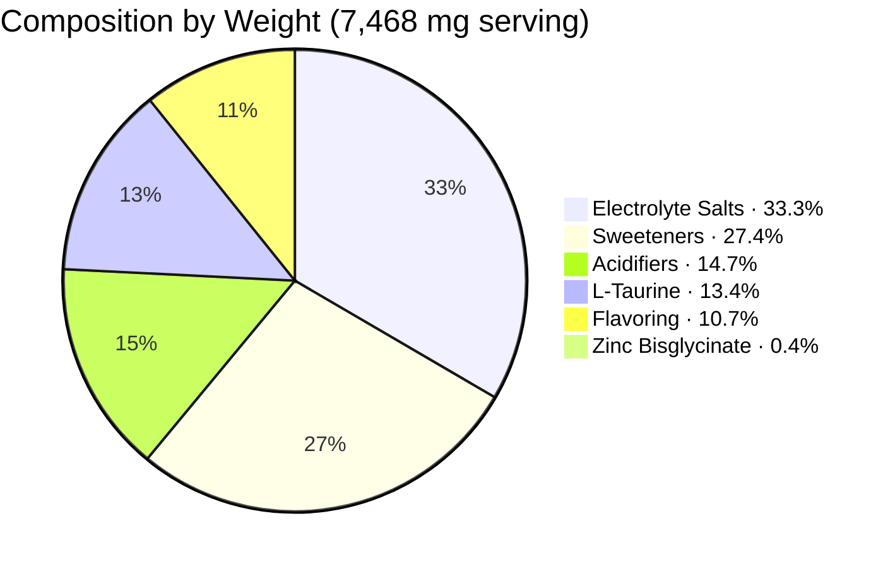

<div align="center">

# Impossible Powders

**Electrolyte powders specifically made for your training**

> Most electrolyte mixes are built for long cardio sessions, heavy on sodium and sugar.<br/>
If you lift weights at the gym, that formula doesn't match what your body actually needs.




Impossible Powders is a line of purpose-built supplements.  
Each formula is designed for a specific use case, not a one-size-fits-all multivitamin in disguise.  
**Impossible Strength** is the first product: an electrolyte mix optimised for resistance training / gym goers.

<br/>


[>> Find out more <<](https://impossiblepowders.com)

</div>

## Table of Contents

- [The Problem](#-the-problem)
- [How It Compares](#-how-it-compares)
- [The Formula](#-the-formula)
- [Taste Architecture](#-taste-architecture)
- [Regulatory Compliance](#-regulatory-compliance)

## The Problem

Almost every electrolyte product on the market is optimised for runners, cyclists and endurance athletes. Oral Rehydration Solutions with high sugar and sodium content that is often not needed unless you are running a marathon.

> [!IMPORTANT]
> **We deliver what your training actually demands:** *Impossible Strength* offers meaningful doses of chloride, magnesium, zinc and potassium in highly bioavailable forms. No empty sugar, no filler vitamins, no vitamin C mega-doses that interfere with strength adaptations.

## How It Compares

Every product in this table was designed for a different job:

| Nutrient | Impossible Strength | LMNT | Liquid IV | Liquid IV SF | Drip Drop | Ultima | Gatorade |
|:---|:---:|:---:|:---:|:---:|:---:|:---:|:---:|
| **Sodium** | 234 mg | 1,000 mg | 500 mg | 530 mg | 330 mg | 55 mg | 150 mg |
| **Potassium** | **300 mg** ✦ | 200 mg | 380 mg | 370 mg | 185 mg | 250 mg | 45 mg |
| **Magnesium** | **120 mg** ✦ | 60 mg | 0 mg | 0 mg | 39 mg | 100 mg | 0 mg |
| **Zinc** | **10 mg** ✦ | 0 mg | 0 mg | 0 mg | 0 mg | 1.1 mg | 0 mg |
| **Taurine** | **1,000 mg** ✦ | 0 mg | 0 mg | 0 mg | 0 mg | 0 mg | 0 mg |
| Sugar | 0 g | 0 g | 11 g | 0 g | 7 g | 0 g | 21 g |
| Serving size | ~7.5 g | 6 g | 16 g | 13 g | 8 g | 3.5 g | ~21 g |
| **Target use** | **Strength** | Keto/Fasting | Rehydration | Rehydration | Rehydration | General | Endurance |

> [!TIP]
> **The pattern:** most products either push sodium to endurance-level doses or skip magnesium and zinc entirely. Impossible Strength is the only formula that prioritises the minerals that matter most for resistance training.

## The Formula

Every ingredient has a reason. Nothing is here for label decoration.

### At a glance

```
  ELECTROLYTE CORE                    PERFORMANCE              TASTE SYSTEM
  ──────────────────                  ───────────              ────────────
  Tripotassium Citrate    790 mg     L-Taurine    1,000 mg    Citric Acid       600 mg
  Trisodium Citrate       745 mg     Zinc Bis-                Malic Acid        500 mg
  Sodium Chloride         150 mg       glycinate     33 mg    Stevia Reb-A       50 mg
  Magnesium Malate        800 mg                              Erythritol      2,000 mg
                        ─────────                             Flavoring         800 mg
                        2,485 mg              1,033 mg                        3,950 mg
  ─────────────────────────────────────────────────────────────────────────────────────
  TOTAL                                                                     7,468 mg
```

<details>
<summary><b>Full ingredient breakdown</b> — click to expand</summary>

<br/>

| Ingredient | Amount | Why it's here |
|:---|:---|:---|
| **Tripotassium Citrate** | 790 mg | Citrate form improves absorption and supports neuromuscular function. Dosed to meet EU "source of" threshold for potassium health claims |
| **Trisodium Citrate** | 745 mg | Improves overall mineral bioavailability and hydration without GI issues |
| **Sodium Chloride** | 150 mg | Replaces sweat sodium without pushing endurance-level doses |
| **Magnesium Malate** | 800 mg | Malate feeds the Krebs cycle for ATP production; magnesium supports force output and recovery. 120 mg elemental — dosed to allow safe 2-serving daily use within EFSA UL of 250 mg/day |
| **Zinc Bisglycinate** | 33 mg | Highly bioavailable chelated form. 10 mg elemental — stays within EFSA UL of 25 mg/day when combined with dietary intake |
| **L-Taurine** | 1,000 mg | Conditionally essential amino acid at a research-relevant dose. *Note: no EU-authorised health claims currently apply to taurine* |
| **Citric Acid** | 600 mg | Sharp upfront tartness, pH correction to ~5.0–5.5, improves mineral solubility |
| **Malic Acid** | 500 mg | Smoother sustained sourness, masks metallic/bitter mineral off-notes; pairs with magnesium malate for Krebs cycle support |
| **Stevia Reb-A (97%)** | 50 mg | Non-caloric sweetness ≈ 10–15 g sugar; high purity minimises bitter/licorice aftertaste |
| **Erythritol** | 2,000 mg | Adds body and mouthfeel; suppresses stevia aftertaste; mild cooling sensation; zero calories, no glycemic impact |
| **Flavoring** (maltodextrin-based) | 800 mg | ~300 mg flavour actives + ~500 mg maltodextrin DE 10–12 carrier. Adds < 2 kcal. Low-DE carrier reduces hygroscopicity and Maillard browning risk |
| **Total** | **7,468 mg** | |

</details>

> [!NOTE]
> **On the citrate load:** The formula's ~1.5 g total citrate produces a modest alkalinizing effect that is protective against kidney stones and mildly supportive of exercise buffering. The solution is hypotonic (~135 mOsm/kg in 500 mL), promoting rapid fluid absorption — ideal for strength training where energy delivery via carbohydrate is not wanted.

### Product composition



<details>
<summary><b>Composition table</b> — click to expand</summary>

<br/>

| Category | Ingredients | Weight | % of Serving |
|:---|:---|---:|---:|
| Electrolyte salts | Potassium, sodium, magnesium salts | 2,485 mg | 33.3% |
| Performance amino | L-Taurine | 1,000 mg | 13.4% |
| Sweeteners | Erythritol + Stevia | 2,050 mg | 27.4% |
| Acidifiers | Citric + Malic Acid | 1,100 mg | 14.7% |
| Flavoring | Flavour actives + maltodextrin | 800 mg | 10.7% |
| Mineral actives | Zinc Bisglycinate | 33 mg | 0.4% |
| **Total** | | **7,468 mg** | **100%** |

</details>

### Nutrition facts

| Nutrient | Per Serving | Per 2 Servings | % NRV (EU) |
|:---|---:|---:|---:|
| Sodium | 234 mg | 468 mg | — |
| Potassium | 300 mg | 600 mg | 15% |
| Magnesium | 120 mg | 240 mg | 32% |
| Chloride | 91 mg | 182 mg | 11% |
| Zinc | 10 mg | 20 mg | 100% |
| Taurine | 1,000 mg | 2,000 mg | — |

<sup>Sodium has no NRV under Regulation (EU) No 1169/2011 Annex XIII. Taurine does not have an established NRV.</sup>

**Recommended intake:** 1–2 servings per day

---

## Taste Architecture

The taste system is designed around four layers, each solving a specific problem. Dissolved in 500 ml water, the mineral base alone tastes metallic (zinc), bitter (magnesium malate), salty (sodium citrate, NaCl), and slightly soapy at alkaline pH. Every ingredient in the taste system has a job.

```mermaid
graph LR
    A["Raw Minerals - metallic · bitter - salty · soapy - pH ~8.0"]
    -->|"600mg citric - 500mg malic"| B["🍋 Layer 1 - Acids - pH → 5.0-5.5"]
    -->|"50mg stevia - 2000mg erythritol"| C["🧊 Layer 2 - Sweeteners - body + mouthfeel"]
    -->|"800mg spray-dried"| D["🍊 Layer 3 - Flavoring - character"]
    --> E["Final Profile - tart · clean - refreshing"]

    style A fill:#ff6b6b,stroke:#c0392b,color:#fff
    style B fill:#feca57,stroke:#f39c12,color:#333
    style C fill:#48dbfb,stroke:#0abde3,color:#333
    style D fill:#ff9ff3,stroke:#f368e0,color:#333
    style E fill:#55efc4,stroke:#00b894,color:#333
```



### Layer 1 — Acids <kbd>1,100 mg</kbd>

> Tartness, pH correction, and mineral masking

Citric acid (600 mg) delivers the immediate sharp "pop" of sourness — the first thing you taste. Malic acid (500 mg) provides a smoother, longer-lasting sourness that specifically masks metallic and bitter off-notes better than citric acid alone. The 55:45 citric-to-malic ratio is industry standard for electrolyte beverages. Together, at a combined concentration of ~0.22% in 500 ml, they pull the solution pH down from ~8.0 to approximately **5.0–5.5** — the sweet spot for taste, tooth safety (enamel erosion kicks in below pH 4.5), and ingredient stability.

### Layer 2 — Sweeteners <kbd>2,050 mg</kbd>

> Sweetness, mouthfeel, and aftertaste control

Stevia Reb-A 97% (50 mg) provides the primary sweetness, equivalent to roughly 10–15 g of sugar in 500 ml — deliberately light and refreshing rather than sugary. Erythritol (2,000 mg) at 0.4% concentration sits below its own sweetness threshold, so it isn't really there for sweetness. It adds body and mouthfeel to what would otherwise feel like thin mineral water, provides a mild cooling sensation that reads as "refreshing," and — critically — suppresses the bitter/licorice aftertaste that stevia carries even at high purity. This synergy is well-documented and is why the combination works where stevia alone often doesn't.

### Layer 3 — Flavoring <kbd>800 mg</kbd>

> Character and carrier

A spray-dried flavoring at 800 mg per serving, composed of approximately 300 mg volatile flavour compounds and 500 mg maltodextrin DE 10–12 carrier. The low dextrose equivalent carrier was chosen to minimise hygroscopicity in the dry powder (supporting the anti-caking strategy) and to reduce Maillard browning potential during storage. Adds less than 2 kcal per serving.

### Layer 4 — Flavour direction

Citrus profiles (lemon-lime, blood orange, grapefruit) are recommended for initial development. The citric-malic acid backbone matches what the palate expects from citrus, making mineral masking easiest. Berry variants (raspberry, blackcurrant) benefit from shifting the ratio slightly toward malic acid. Tropical profiles (mango, passionfruit) may require pushing stevia to 60 mg for adequate sweetness.

The overall sweet-sour balance leans tart — this is intentional. Electrolyte drinks that lean sweet cause flavour fatigue during exercise, while tart-forward profiles encourage continued drinking. If testers find it too sharp, the first adjustment should be pushing stevia to 60 mg rather than reducing acid, which would compromise mineral masking and pH correction.

> [!TIP]
> Citrus flavours (lemon/lime, orange) do a much better job masking mineral taste than vanilla or creamy profiles (chocolate, milk).

---

## Regulatory Compliance

<details>
<summary><b>EU-Authorised Health Claims</b> — click to expand</summary>

<br/>

The following claims are authorised under Commission Regulation (EU) No 432/2012 and may be used on labelling and marketing materials, provided the product meets the relevant conditions per Regulation (EC) No 1924/2006.

#### Magnesium <kbd>120 mg — 32% NRV</kbd> qualifies as *"high in magnesium"*

- Contributes to electrolyte balance
- Contributes to normal muscle function
- Contributes to normal energy-yielding metabolism
- Contributes to a reduction of tiredness and fatigue
- Contributes to normal protein synthesis

#### Zinc <kbd>10 mg — 100% NRV</kbd> qualifies as *"high in zinc"*

- Contributes to normal protein synthesis
- Contributes to the maintenance of normal testosterone levels in the blood
- Contributes to the normal function of the immune system

#### Potassium <kbd>300 mg — 15% NRV</kbd> qualifies as *"source of potassium"*

- Contributes to normal muscle function
- Contributes to normal functioning of the nervous system
- Contributes to the maintenance of normal blood pressure

> [!CAUTION]
> **Taurine has no EU-authorised health claims.** EFSA evaluated taurine for claims relating to immune function, metabolism, cognition, cardiac function, muscle function and exercise fatigue (EFSA-Q-2008-1398 et al.) — all were rejected. No function claims may be made for taurine on consumer-facing materials.

</details>

<details>
<summary><b>EFSA Upper Limit Compliance</b> — click to expand</summary>

<br/>

| Nutrient | Per Serving | Per 2 Servings | EFSA UL (supplemental) | Status |
|:---|---:|---:|:---|:---|
| Magnesium | 120 mg | 240 mg | 250 mg/day | ✅ 10 mg under UL |
| Zinc | 10 mg | 20 mg | 25 mg/day (all sources) | ✅ 5 mg under UL |

All minerals remain within EFSA Tolerable Upper Intake Levels at the maximum recommended intake of 2 servings per day.

</details>

<details>
<summary><b>Mandatory Label Statements</b> (Directive 2002/46/EC) — click to expand</summary>

<br/>

- "Do not exceed the stated recommended daily dose (2 servings)"
- "Food supplements should not be used as a substitute for a varied and balanced diet"
- "Keep out of reach of young children"
- "All nutrient amounts declared per serving with % NRV (Regulation (EU) No 1169/2011)"

</details>

---

<div align="center">

<br/>

**[Discover more here](https://impossiblepowders.com)**

<br/>

Made by [Impossible Labs](https://impossiblelabs.xyz)

</div>
